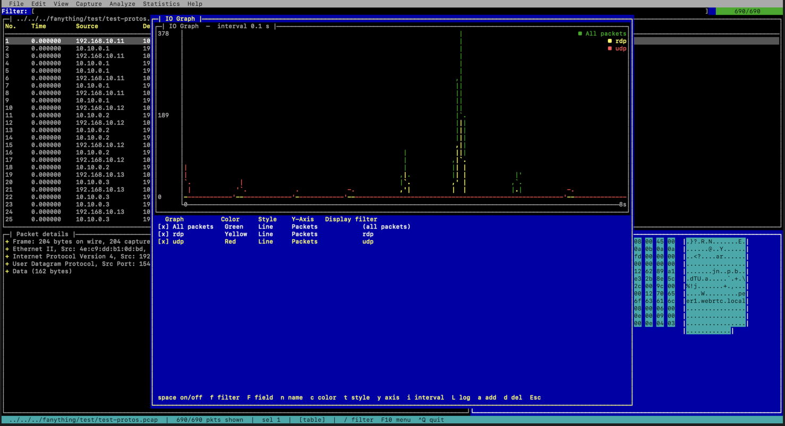

# carcal



A terminal packet analyzer — a tiny Wireshark for the TUI. carcal opens
pcap/pcapng captures, lists packets in a **table view**, shows the selected
packet's protocol layers in a **tree view**, and filters with a
**Wireshark/tshark-compatible display-filter** syntax. New protocols can be
defined at runtime with libpcapng-style `.posa` files and bound to ports.

It also has a **command-line scripting mode** (a generalized
[MQS](https://github.com/stricaud/MQS)): instead of decoding only MySQL and
handing a query string to Lua, carcal decodes *any* protocol and hands the
fully decoded fields — and reassembled IP datagrams and TCP streams — to a
**LuaJIT** script.

Built on:

- **[gtcaca](../gtcaca)** — libcaca TUI widget toolkit (table, tree, menu,
  filechooser, dialog, entry, status bar).
- **[libpcapng](../libpcapng)** — pcapng reading; IP-fragment and TCP-stream
  reassembly (`libpcapng_reasm_*`, `pcapng_tcp_reasm_*`); `.posa` protocols.
- **LuaJIT** — embedded scripting engine (found via `pkg-config`).

## Building

Both dependencies must be built first (their `build/` trees are found
automatically as siblings of this repo). libcaca is found via `pkg-config`.

```sh
mkdir build && cd build
cmake ..
make
./carcal /path/to/capture.pcapng
```

Override dependency locations if they live elsewhere:

```sh
cmake .. -DGTCACA_ROOT=/path/to/gtcaca -DLIBPCAPNG_ROOT=/path/to/libpcapng
```

> **Runtime note.** carcal needs the *current* gtcaca and libpcapng shared
> libraries (the scripting mode uses libpcapng's reassembly API). If an older
> copy is already installed in `/usr/local/lib`, it can shadow the freshly built
> one. Either install the up-to-date libraries from their build dirs
> (`sudo make install` in each `build/`), or run with
> `DYLD_LIBRARY_PATH=/path/to/libpcapng/build/lib`.

## Using it

| Key | Action |
|-----|--------|
| `F2` / `^O` | Open a capture file |
| `F10` | Open the menu bar (File / Analyze / Help) |
| `/` | Jump to the display-filter box |
| `Tab` | Cycle focus: filter → packet table → detail tree |
| `↑ ↓ PgUp PgDn Home End` | Navigate the focused pane |
| `← → / Space / Enter` | Collapse/expand a detail-tree node |
| `^F` | Find packet (text, or `hex:DE AD BE EF`) |
| `n` / `N` | Jump to next / previous find match |
| `q` / `^Q` | Quit |

The lower area is split into the **detail tree** (left) and a Wireshark-style
**hex byte pane** (right) for the selected packet. Menus (F10):

- **Edit** — Find Packet / Find Next / Find Previous.
- **Analyze** — Follow TCP Stream, Follow UDP Stream, Decode As…, Decoders…
  (list built-in + loaded `.posa` decoders; `i` import a `.posa`, `n` write a
  new one in the built-in editor with a posa cheat-sheet panel; `^S` saves &
  loads it).
- **Statistics** — IO Graph (packets per interval; green = all, yellow = current
  filter match), drawn with gtcaca's line chart.

### Display filters

Type an expression in the filter box and press `Enter`. Examples:

```
ip.addr == 192.168.1.0/24
tcp.port == 443 && ip.src != 10.0.0.1
udp and dns.qry.name contains "example"
icmp || arp
tcp.flags == 0x12
eth.src == aa:bb:cc:dd:ee:ff
```

Operators: `== eq`, `!= ne`, `> gt`, `< lt`, `>= ge`, `<= le`, `contains`,
`matches` (substring), `&& and`, `|| or`, `! not`, parentheses. Fields use
Wireshark names (`ip.src`, `tcp.dstport`, `dns.qry.name`, …). Aliases match
either direction: `ip.addr`, `ipv6.addr`, `tcp.port`, `udp.port`, `eth.addr`.

A bare field name is an existence test (`tcp`, `dns`).

### Custom protocols (.posa)

carcal loads every `*.posa` in its `protos/` directory at startup, and you can
load more with **File ▸ Load .posa…**. A definition looks like:

```
Object<main> SensorBeacon
    required mac    sensor_mac = 00:00:00:00:00:00
    required ip4    sensor_ip  = 0.0.0.0
    required uint32 uptime_sec = 0
    required uint16 battery_mv = 3300
    required uint8  seq = 0
```

Then bind it to a transport port via **Analyze ▸ Decode As…**, entering e.g.
`udp 6666 SensorBeacon`. Matching packets are then dissected with that protocol,
its fields appearing in the detail tree and usable in filters
(`SensorBeacon.seq == 1`).

Field types: `uint8/16/32/64`, `le_uint16/32/64`, `mac`, `ip4`, `cstring`,
`payload`, `bytes<N>`, `bytes[lenfield]`. Indented `NAME = value` lines under an
integer field define enum labels. `Object<parent>` groups sub-protocols
dispatched on the first field's value (see `protos/tftp.posa`).

## Command-line scripting (LuaJIT)

Drive captures from a Lua script — the generalized MQS use-case. Selecting `-s`
enters scripting mode (no TUI):

```sh
carcal -s script.lua -r capture.pcapng \
        [-f "display filter"] [-X "tcp 3306 MySQL"] [-p extra.posa]
```

| Flag | Meaning |
|------|---------|
| `-s` | Lua script to run |
| `-r` | capture file to read (pcap/pcapng) |
| `-f` | display filter limiting which packets reach `packet()` |
| `-X` | bind a port to a `.posa` protocol (`"<udp\|tcp> <port> <Proto>"`), repeatable |
| `-p` | load an extra `.posa` file, repeatable |

A script defines any of these entry points:

```lua
function init()          end   -- once, before processing
function packet(pkt)     end   -- per (IP-defragmented) packet
function stream(s)       end   -- per reassembled in-order TCP chunk
function finish(stats)   end   -- once, after processing
```

`pkt` carries the decoded packet and its fields in their various forms:

```lua
pkt.number, pkt.time, pkt.len, pkt.protocol, pkt.src, pkt.dst, pkt.info
pkt.srcport, pkt.dstport, pkt.l4, pkt.payload   -- transport payload (full bytes)
pkt.raw                                          -- whole frame bytes
pkt.layers          -- { "eth", "ip", "tcp", … }  ordered
pkt.fields["ip.src"]                             -- natural Lua value
pkt:get("ip.src")   -- { type=, value=, hex=, label= }  (the "various ways")
pkt:getall("ip.addr")                            -- every matching field
pkt:has("tcp")                                   -- existence test
pkt:matches("tcp.flags == 0x02")                 -- the display-filter engine
```

Globals decode arbitrary bytes — including "the various ways a protocol can be
decoded":

```lua
carcal.decode_as(bytes, "TFTP")    -- dispatched posa decode → {field=value,…}
carcal.decode_all(bytes, "TFTP")   -- every candidate sub-protocol's decode
carcal.dissect(bytes [, linktype]) -- full built-in dissection of raw bytes
carcal.protocols()                 -- names of loaded posa protocols
carcal.hex(bytes)
```

### Reassembly

- **IP fragments** are reassembled by libpcapng (`libpcapng_reasm_add`); a
  fragmented datagram reaches `packet()` whole.
- **TCP streams** are reassembled by libpcapng's `pcapng_tcp_reasm_*` API (added
  as a library feature, not specific to carcal). In-order bytes per direction
  arrive at `stream(s)` with `s.data` (new bytes), `s.all` (cumulative),
  `s.src/dst/srcport/dstport/dir`, and `s:decode_as(proto)`.

Bundled examples are in [`scripts/`](scripts/): `summary.lua`, `fields.lua`,
`tftp.lua`, and `mysql-queries.lua` (sniff MariaDB/MySQL `COM_QUERY` statements
from a reassembled stream — the MQS use-case, on any capture file):

```sh
carcal -s scripts/mysql-queries.lua -r dump.pcapng -f "tcp.port == 3306"
```

## Packaging (Linux & macOS)

`packaging/build.sh` builds carcal + the sibling libraries (gtcaca, libpcapng)
in Release and produces a **self-contained** tarball under `dist/` — every
non-system library (gtcaca, libpcapng, libcaca, luajit, oniguruma) is bundled
and the binary's load paths are rewritten (`@executable_path/../lib` on macOS,
`$ORIGIN/../lib` on Linux), so it runs with no Homebrew / `LD_LIBRARY_PATH`.

```sh
# libraries checked out next to this repo (../gtcaca, ../libpcapng):
packaging/build.sh
# → dist/carcal-macos-arm64.tar.gz   (or carcal-linux-x86_64.tar.gz, …)
```

The tarball contains `carcal` (a launcher that points at its bundled
`protos/` and `grammars/`), `bin/carcal`, and `lib/`. carcal honors
`CARCAL_PROTOS_DIR` / `CARCAL_GRAMMARS_DIR` so the bundle finds its data
wherever it's unpacked.

`build.sh` also emits a native installer alongside the tarball:

- **macOS** — `dist/carcal-macos-<arch>.pkg` (installs to `/usr/local/carcal`,
  symlinks `/usr/local/bin/carcal`). Unsigned, so first run is right-click ▸
  Open or `installer -pkg … -target /`; sign/notarize separately for wide
  distribution.
- **Linux** — `dist/carcal-linux-<arch>.AppImage`, a single self-contained
  executable (built with `linuxdeploy`; an `AppRun` hook points carcal at its
  bundled data). Falls back to just the tarball if `linuxdeploy` can't be
  fetched.

CI ([.github/workflows/release.yml](.github/workflows/release.yml)) builds the
same artifacts on a matrix (Linux x86_64, macOS arm64 + x86_64) and attaches
them to a release when a `v*` tag is pushed. Cross-compiling is intentionally
avoided — each platform builds natively (libcaca's terminal backends make
cross-builds of the C dependencies more trouble than a CI matrix).

## Live capture

**Capture ▸ Start…** lists your interfaces (via libpcapng's live-capture API),
lets you pick one and optionally enter a capture filter (Wireshark display-
filter syntax, applied in-kernel), and streams packets into the table in real
time — the display filter still narrows what's shown, and the view auto-follows
the newest packet. **Capture ▸ Stop** ends it.

Opening an interface needs privileges: **root**, or on Linux
`sudo setcap cap_net_raw+eip $(readlink -f ./carcal)`. Listing interfaces does
not. Captured frames are assumed Ethernet.

## Scope / limitations

- pcapng is read via libpcapng; classic `.pcap` via a small built-in reader;
  live capture via libpcapng's capture API (Linux `PACKET_MMAP`, macOS `bpf`).
- Built-in dissectors: Ethernet/802.1Q, IPv4, IPv6 (base header), ARP, TCP,
  UDP, ICMP/ICMPv6, DNS. Everything else is reachable through `.posa`.
- Filters use "any" matching semantics for multi-valued fields, like Wireshark.
